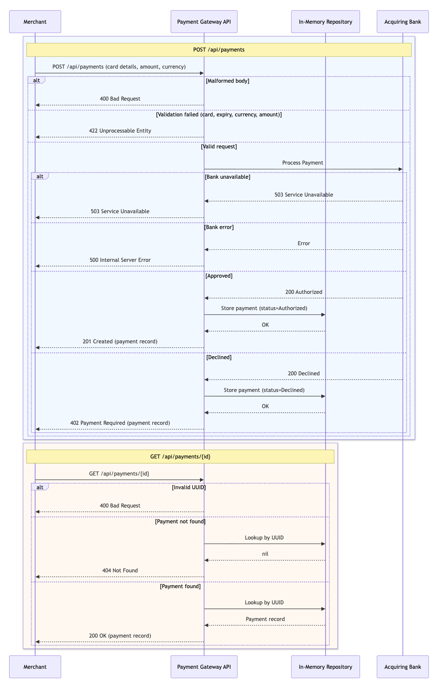
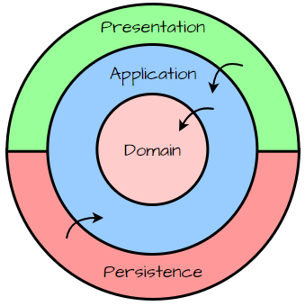

# Payment Gateway - Go

An HTTP API that allows merchants to process card payments and retrieve their details. Built as the Checkout.com engineering assessment.

Below `Sequence Diagram` is an overview of the current state of the API.



## Requirements

- Go 1.24+
- Docker + Docker Compose

## Running locally

Start the full stack (gateway + bank simulator + observability):

```bash
docker compose up -d --build
```

- The gateway starts on **port 8090**.
- Swagger UI: <http://localhost:8090/swagger/index.html>
- Grafana UI: <http://localhost:3000>

To run the gateway only (requires bank simulator already running):

```bash
task run
# or
ACQUIRING_BANK_URL=http://localhost:8080 go run ./cmd/api/main.go
```

## API

The APIs are Swagger documented and up to date however below is just an overview of each endpoint.

### POST /api/payments

Process a card payment. Three outcomes are possible:

| Outcome    | Status                     | Condition                             |
| ---------- | -------------------------- | ------------------------------------- |
| Authorized | `201 Created`              | Bank approved                         |
| Declined   | `402 Payment Required`     | Bank declined (payment still stored)  |
| Rejected   | `422 Unprocessable Entity` | Validation failed - bank never called |

**Request body:**

```json
{
    "card_number": "2222405343248871",
    "expiry_month": 8,
    "expiry_year": 2026,
    "currency": "GBP",
    "amount": 100,
    "cvv": "123"
}
```

**Validation rules:**

| Field          | Rules                                                         |
| -------------- | ------------------------------------------------------------- |
| `card_number`  | Required, numeric, 14-19 digits                               |
| `expiry_month` | Required, 1-12                                                |
| `expiry_year`  | Required; combination of month + year must be in the future   |
| `currency`     | Required, one of: `USD`, `GBP`, `EUR`                         |
| `amount`       | Required, integer ≥ 1 (minor currency unit, e.g. 100 = £1.00) |
| `cvv`          | Required, numeric, 3-4 digits                                 |

**Response (201):**

```json
{
    "success": true,
    "data": {
        "id": "f8d728da-2c1a-46aa-bea8-233eb314b140",
        "payment_status": "Authorized",
        "card_number_last_four": "8871",
        "expiry_month": 12,
        "expiry_year": 2026,
        "currency": "GBP",
        "amount": 100
    },
    "timestamp": "2026-04-23T07:36:57Z"
}
```

**Error Responses:**

Except `401 - payment declined` response which provides a `data` field containing the payment request all other responses `statuses > 200` return a standard error response.

_401 - payment declined:_

```json
{
    "success": false,
    "data": {
        "id": "4d2b31da-d57d-4602-83d7-b909251da938",
        "payment_status": "Declined",
        "card_number_last_four": "8872",
        "expiry_month": 12,
        "expiry_year": 2026,
        "currency": "GBP",
        "amount": 100
    },
    "error": {
        "code": "PAYMENT_DECLINED",
        "message": "bank declined payment"
    },
    "timestamp": "2026-04-23T07:36:01Z"
}
```

_Standard error response:_

```json
{
    "success": false,
    "error": {
        "code": "SERVICE_UNAVAILABLE",
        "message": "payment processor is temporarily unavailable"
    },
    "timestamp": "2026-04-23T07:37:36Z"
}
```

### GET /api/payments/{id}

Retrieve a previously processed payment by its UUID.

| Status            | Condition               |
| ----------------- | ----------------------- |
| `200 OK`          | Payment found           |
| `400 Bad Request` | ID is not a valid UUID  |
| `404 Not Found`   | No payment with that ID |

`200 - OK response`

```json
{
    "success": true,
    "data": {
        "id": "d19e8734-f5ff-4baa-bf56-4dd43530c4e4",
        "payment_status": "Authorized",
        "card_number_last_four": "8871",
        "expiry_month": 12,
        "expiry_year": 2026,
        "currency": "GBP",
        "amount": 100
    },
    "timestamp": "2026-04-23T07:58:00Z"
}
```

## Project structure

The project aims to be structured as a simplified version of the very popular `Clean Architecture` but since the business logic is not extensive I skipped the service layer. Thus, API handlers communicate directly with the repo layer.



```
cmd/api/          entry point
internal/
  api/            router, controllers, Swagger types, DTOs
  adapters/bank/  bank adapter interface + Mountebank HTTP implementation
  config/         env-based configuration
  handlers/       HTTP handler logic
  httputil/       request decoding, response writing, middleware
  models/         domain types and validation
  repository/     in-memory payment store
pkg/tel/          OpenTelemetry setup (traces, metrics, logs)
tests/integration integration tests (testcontainers + Mountebank)
imposters/        Mountebank bank simulator configuration
```

## Configuration

All settings are read from environment variables, see `.env.example` for custom configuration:

| Variable                      | Default                 | Description                    |
| ----------------------------- | ----------------------- | ------------------------------ |
| `ACQUIRING_BANK_URL`          | `http://localhost:8080` | Bank simulator URL             |
| `OTEL_EXPORTER_OTLP_ENDPOINT` | `localhost:4317`        | OTLP gRPC endpoint (no scheme) |
| `SERVICE_NAME`                | `payment-gateway`       | OTel service name              |
| `SERVICE_VERSION`             | `0.1.0`                 | OTel service version           |
| `HTTP_PORT`                   | `8090`                  | Listening port                 |

## Testing

Unit tests (no external dependencies):

```bash
go test ./...
# or
task test
```

Integration tests (requires Docker - spins up Mountebank via testcontainers):

```bash
go test -tags integration ./tests/integration/... -v
# or
task test-integration
```
### API Collection and manual testing 

Since the Swagger UI spins up at startup no Postman collection was provide, however to support manual testing use the [http client file](./req.http).

## Observability

The gateway ships full OpenTelemetry instrumentation. When running via `docker compose`, traces, metrics and logs are exported to a local [Grafana LGTM](https://github.com/grafana/docker-otel-lgtm) stack:

- Grafana UI: <http://localhost:3000> (admin / admin)
- Traces - Tempo
- Metrics - Prometheus
- Logs - Loki

Every request gets a `X-Request-ID` header and a scoped structured logger propagated through context. Handlers emit child spans for storage and bank calls.

Note: this is not the perfect implementation - I took the chance to practice more with the OTel and Grafana.

## Design decisions

- **In-memory storage** - sufficient for the scope of this challenge; a production implementation would use a persistent store (PostgreSQL, DynamoDB).
- **Declined payments are stored** - a declined payment is still a completed transaction record; merchants need the ID and status for reconciliation.
- **Synchronous bank call** - the simulator responds instantly, so a sync request/response pattern is appropriate here. A production gateway would use an async queue with idempotency keys to prevent double-charges on retries.
- **UUID generated by the gateway** - the payment ID is assigned at authorization time, not supplied by the merchant, keeping the API surface minimal.
- **No authentication** - out of scope for this challenge. A real implementation would use API-key (would allow to identify merchant, impose quota and key-based rate limit) or OAuth-based auth to identify and rate-limit merchants.
- **Bank response** - with the addition of new banks it requires abstraction and mapping DTOs.
- **Card number and CVV** - can start with 0 (zero) so they must be string.
- **Request ID header**  - each request responds with a `X-Request-Id: 2cb2bbbd-819c-4a3f-ba1b-fc59f96dac36` which should support debugging and support queries.