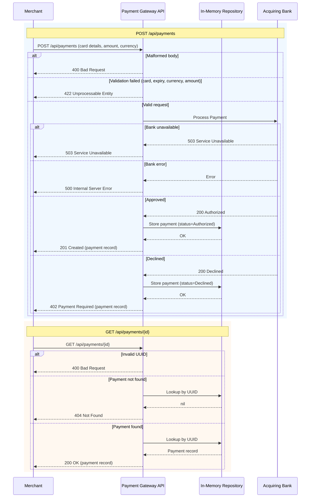

# Mermaid script

```mermaid
sequenceDiagram
    participant M as Merchant
    participant G as Payment Gateway API
    participant DB as In-Memory Repository
    participant B as Acquiring Bank

    %% POST /api/payments
    rect rgb(240, 248, 255)
        note over M,B: POST /api/payments
        M->>G: POST /api/payments (card details, amount, currency)

        alt Malformed body
            G-->>M: 400 Bad Request
        else Validation failed (card, expiry, currency, amount)
            G-->>M: 422 Unprocessable Entity
        else Valid request
            G->>B: Process Payment
            alt Bank unavailable
                B-->>G: 503 Service Unavailable
                G-->>M: 503 Service Unavailable
            else Bank error
                B-->>G: Error
                G-->>M: 500 Internal Server Error
            else Approved
                B-->>G: 200 Authorized
                G->>DB: Store payment (status=Authorized)
                DB-->>G: OK
                G-->>M: 201 Created (payment record)
            else Declined
                B-->>G: 200 Declined
                G->>DB: Store payment (status=Declined)
                DB-->>G: OK
                G-->>M: 402 Payment Required (payment record)
            end
        end
    end

    %% GET /api/payments/{id}
    rect rgb(255, 248, 240)
        note over M,DB: GET /api/payments/{id}
        M->>G: GET /api/payments/{id}

        alt Invalid UUID
            G-->>M: 400 Bad Request
        else Payment not found
            G->>DB: Lookup by UUID
            DB-->>G: nil
            G-->>M: 404 Not Found
        else Payment found
            G->>DB: Lookup by UUID
            DB-->>G: Payment record
            G-->>M: 200 OK (payment record)
        end
    end
```
